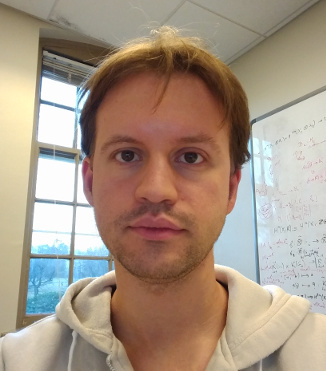

<header>

[&uarr;](#)

[Guillaume Brunerie](#)

* [About me]
* [CV, papers, talks](#curriculum-vitae-papers-and-talks)
* [Other interests]
* [Contact]

</header>

<section>
About me
========

My name is Guillaume Brunerie and I’m a researcher in mathematics and computer science working
mainly in *homotopy type theory*, a field combining mathematics (in particular homotopy theory,
category theory, and constructive mathematics) and theoretical computer science (in particular type
theory, logic, and proof assistants).

I am currently a postdoctoral researcher in the [Logic
Group](https://www.su.se/english/research/2.19150/logic-group){.secondarylink} of [Stockholm
University](https://www.su.se/english/){.secondarylink} since September 2018.

Previously, I was a postdoctoral member of the
[School of Mathematics](https://www.math.ias.edu/){.secondarylink} of the
[Institute for Advanced Study](https://www.ias.edu){.secondarylink} in Princeton, New Jersey.

<small>(last updated in August 2019)</small>
</section>

<section>
Curriculum Vitae, papers and talks
==================================

CV
--

You can find my full CV [here](pdf/cv.pdf).

PhD thesis
----------

From September 2013 to August 2016, I was a PhD student at the
[Laboratoire J.A. Dieudonné](http://math.unice.fr/laboratoire/pr%C3%A9sentation-du-laboratoire){.secondarylink}
under the supervision of [Carlos Simpson](http://math.unice.fr/~carlos/){.secondarylink}. I successfully defended my
thesis on June 15th 2016.

* [*On the homotopy groups of spheres in homotopy type theory*](https://arxiv.org/abs/1606.05916)
  (187 pages, in English, with a 20-page summary in French at the end). You can
  also download the [slides of the oral presentation](pdf/soutenance.pdf).

Publications
------------

[comment]: # (Each publication has four lines:)
[comment]: # (Name of the article with link)
[comment]: # (Authors)
[comment]: # (Journal and editor)
[comment]: # (DOI)

* [*The James construction and $\pi_4(\mathbb{S}^3)$ in homotopy type theory*](https://arxiv.org/abs/1710.10307).
  Guillaume Brunerie.
  Journal of Automated Reasoning, Special Issue on Homotopy Type Theory and Univalent Foundations, Springer.
  [doi:10.1007/s10817-018-9468-2](https://doi.org/10.1007/s10817-018-9468-2){.secondarylink}.
* [*A Cubical Approach to Synthetic Homotopy Theory*](pdf/lb15cubicalsynth.pdf).
  Dan Licata and Guillaume Brunerie.
  2015 30th Annual ACM/IEEE Symposium on Logic in Computer Science (LICS 2015), pages 92–103, IEEE.
  [doi:10.1109/LICS.2015.19](https://doi.org/10.1109/LICS.2015.19){.secondarylink}.
* [*$\pi_n(S^n)$ in Homotopy Type Theory*](pdf/lb13cpp.pdf).
  Dan Licata and Guillaume Brunerie.
  Certified Programs and Proofs (CPP 2013), volume 8307 of Lecture Notes in Computer Science (LNCS), pages 1–16. Springer.
  [doi:10.1007/978-3-319-03545-1](https://doi.org/10.1007/978-3-319-03545-1){.secondarylink}.

Preprints and other writings of interest
----------------------------------------

* [*Cartesian Cubical Type Theory*](pdf/cart-cube.pdf). Carlo
  Angiuli, Guillaume Brunerie, Thierry Coquand, Kuen-Bang Hou (Favonia), Robert Harper, Daniel R. Licata. 
  Preprint.
* [*The Steenrod squares in homotopy type theory (extended abstract)*](http://types2017.elte.hu/proc.pdf#page=45).
  Guillaume Brunerie. TYPES 2017
* [*Homotopy Type Theory: Univalent Foundations of Mathematics*](https://homotopytypetheory.org/book/).
  The Univalent Foundations Program (collective book), Institute for Advanced Study, 2013

Slides of talks
---------------

* [*A formalization of the initiality conjecture in Agda*](pdf/initiality.pdf), Homotopy Type Theory
* 2019 Conference, Carnegie Mellon University, Pittsburgh, Pennsylvania, August 2019
* [*Formalization in Agda (part I only)*](pdf/SummerSchool1.pdf), Homotopy Type Theory 2019 Summer
  School, Carnegie Mellon University, Pittsburgh, Pennsylvania, August 2019
* [*Computer-generated proofs for the monoidal structure of the smash product*](pdf/monoidalsmashproduct.pdf),
  HoTTEST Seminar, November 2018
* [*Experiments in cubical type theory*](pdf/cubicalexperiments.pdf), Joint Mathematics
  Meetings, AMS Special Session on Homotopy Type Theory (a Mathematics Research Communities
  Session), San Diego, California, January 2018
* [*Homotopy type theory: working invariantly in homotopy theory*](pdf/shorttalk2.pdf), Short talks
  by postdoctoral members, School of Mathematics, IAS, Princeton, New Jersey, September 2017
* [*Invariant homotopy theory in the univalent foundations*](pdf/shorttalk.pdf), Short talks by
  postdoctoral members, School of Mathematics, IAS, Princeton, New Jersey, September 2016
* [*Custom definitional equalities in Agda*](pdf/talkicms.pdf), in the
  “[Univalent Foundations and Proof Assistants](https://icms2016unimath.github.io/mainpage){.secondarylink}”
  session of the International Congress on Mathematical Software (ICMS 2016), Berlin, Germany, July 2016
* [*A Cubical Approach to Synthetic Homotopy Theory*](pdf/lics15.pdf), at
  [LICS 2015](http://lics.rwth-aachen.de/lics15/){.secondarylink}, Kyoto, Japan, July 2015
* [*Homotopy Type Theory*](pdf/talkJFLA.pdf), at the conference
  “[Journées francophones des languages applicatifs](http://jfla.inria.fr/2014/){.secondarylink}”,
  Fréjus, France, January 2014
* [*An elementary definition of weak $\infty$-groupoids*](pdf/cmssm13.pdf), in the session
  “[Progress in Higher Categories](https://cms.math.ca/Events/summer13/sessions_scientific#pih){.secondarylink}”
  of the CMS Summer Meeting, Halifax, Nova-Scotia, Canada, June 2013
* [*Le théorème de complétude de Gödel*](pdf/TheoremeDeCompletude.pdf) (in French), in the
  “Séminaire de mathématiques des élèves du lycée Louis le Grand”, Paris, France, February 2009

Videos of talks
---------------

* [*Computer-generated proofs for the monoidal structure of the smash product*](https://youtu.be/JEUvWyd1mTk), for the
  electronic seminar [HoTTEST](https://www.uwo.ca/math/faculty/kapulkin/seminars/hottest.html){.secondarylink}
* [*Homotopy type theory: working invariantly in homotopy theory*](https://video.ias.edu/postdoc/2017/0926-GuillaumeBrunerie),
  Short talks by postdoctoral members, School of Mathematics, IAS, Princeton, New Jersey, September 2017
* [*Invariant homotopy theory in the univalent foundations*](https://video.ias.edu/shorttalks/2016/0928-GuillaumeBrunerie),
  Short talks by postdoctoral members, School of Mathematics, IAS, Princeton, New Jersey, September 2016
* [*The fourth homotopy group of the three-dimensional sphere*](http://www.fields.utoronto.ca/video-archive/2016/05/2012-15042)),
  at the
  “[Workshop on Homotopy Type Theory and Univalent Foundations of Mathematics](http://www.fields.utoronto.ca/activities/15-16/homotopy-type){.secondarylink},
 Fields Institute, Toronto, Ontario, Canada, May 2016
* [*Homotopy Theory in Type Theory*](https://video.ias.edu/univalent/1213/0411-HomotopyGroup), with
  Dan Licata and Peter Lumsdaine, at the seminar of the Institute for Advanced Study, Princeton, New
  Jersey, April 2013
* [*The James construction and $\pi_4(S^3)$*](https://video.ias.edu/univalent/1213/0327-GuillaumeBrunerie),
  at the seminar of the special year of the IAS, Princeton, New Jersey, March 2013
* [*$\pi_2(S^2)$ in HoTT*](https://video.ias.edu/univalent/1213/0220-GuillaumeBrunerie),
  at the seminar of the special year of the IAS, Princeton, New Jersey, February 2013
* [*Weak infinity-groupoids, part I*](https://video.ias.edu/1213/univalent/0130-GuillaumeBrunerie)
  (no video for part II), at the seminar of the special year of the IAS, Princeton, New Jersey,
  January 2013

Others writings
---------------

- A [poster](pdf/poster.pdf) on homotopy type theory (in French, 2015).
- A Python script generating Agda code for semi-simplicial types, truncated at any given
  level ([script](other/semisimplicial.py), [result for $n=10$](other/semisimplicial10.txt))
- [*Structure topologique de l’espace des réseaux unitaires*](pdf/TIPEvENS.pdf), initiation to
  research on the proof that the space of unitary lattices of $\mathbb{R}^2$ is homemorphic to the
  complement of the trefoil knot in $S^3$ (in French, 2009).
- [*Densdisigeblaj spacoj*](pdf/densdisigeblajspacoj.pdf), a proof of a theorem in point-set
  topology: every metric space without isolated points can be partitioned in two dense subspaces (in
  Esperanto, 2008).

<section>
Other interests
===============

I’m also interested in programming and free software, and I have some experience with various
programming languages like Javascript, Python, Lua, OCaml, C, shell scripting, Haskell. Some of my
projects are available on [my GitHub page](https://github.com/guillaumebrunerie).

</section>

<section>
Contact
=======

You can contact me by email at the address <guillaume.brunerie@gmail.com> or <brunerie@math.su.se>.
</section>

